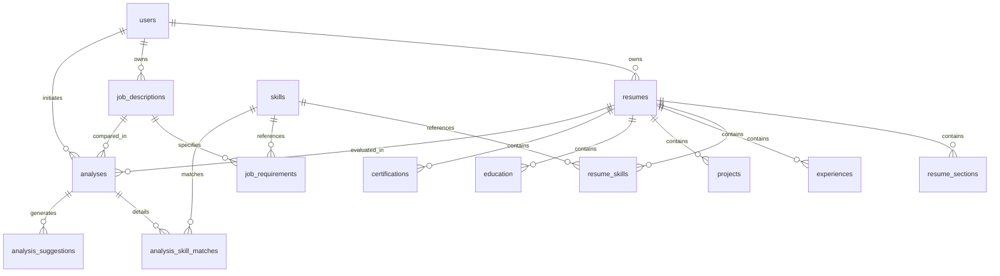

# ResumeIQ — Resume Intelligence & Job Matching Platform

[](https://github.com/your-org/resumeiq/actions)
[](https://fastapi.tiangolo.com)
[](https://nextjs.org)
[](https://www.postgresql.org)
[](https://redis.io)
[](https://docs.celeryq.dev)

ResumeIQ is a production-grade full-stack platform that transforms unstructured candidate resumes and complex job descriptions into structured intelligence, transparent multi-dimensional compatibility scores, and actionable hiring insights.

Unlike opaque "black-box" matching tools, ResumeIQ evaluates candidate alignment across **transparent, configurable criteria**, highlights exact and semantically related skills, attributes evidence tiers (`STRONG`, `MODERATE`, `WEAK`), and generates actionable resume improvement guidance.

---

## 1. System Architecture

```
                    ┌────────────────────────────────────────────────────────┐
                    │                  Next.js 14 (App Router)               │
                    │  TypeScript · Tailwind CSS · Lucide · Recharts · SWR   │
                    └───────────────────────────┬────────────────────────────┘
                                                │ HTTPS / REST (JSON & Multipart)
                                                ▼
                    ┌────────────────────────────────────────────────────────┐
                    │                   FastAPI Gateway                      │
                    │   Pydantic V2 · OAuth2 JWT · Rate Limiter · CORS       │
                    └───────┬───────────────────┬────────────────────┬───────┘
                            │                   │                    │
             SQLAlchemy 2.0 │                   │ Redis Client       │ Celery Task Dispatch
                            ▼                   ▼                    ▼
       ┌──────────────────────────────┐ ┌───────────────┐ ┌──────────────────────┐
       │       PostgreSQL 16          │ │  Redis 7      │ │    Celery Worker     │
       │  Relational Normalized Data  │ │ Broker, Cache │ │  Async Pipeline &    │
       │  ACID · Indexes · JSONB      │ │ Rate Limiter  │ │  Heavy NLP Engine    │
       └──────────────────────────────┘ └───────────────┘ └──────────┬───────────┘
                                                                     │
                                               ┌─────────────────────┴──────────┐
                                               │          NLP Subsystem         │
                                               │  · PDF Extract (pdfplumber)   │
                                               │  · Section & Entity Parser     │
                                               │  · Canonical Skill Taxonomy    │
                                               │  · Evidence Level Classifier   │
                                               │  · Semantic Proximity (TF-IDF) │
                                               │  · Explainable Scorer (40/20..)│
                                               └────────────────────────────────┘
```

---

## 2. Core Capabilities & Features

1. **Authentication & Authorization**: Secure user registration, login, bcrypt password hashing, and JWT bearer token issuance with strict row-level ownership isolation.
2. **Multi-Tier PDF Parser**: Dual-layer text and layout extraction using `pdfplumber` with fallback to `pypdf`. Detects image-only/scanned documents early with explicit feedback.
3. **Structured Resume Extraction**: Automatic section segmentation (Summary, Experience, Education, Projects, Skills, Certifications) and entity extraction (roles, companies, durations in years, bullet points, GPA).
4. **Curated Skill Taxonomy (500+ Skills)**: Resolves variants and aliases to canonical standards (`React.js` $\to$ `React`, `Postgres` $\to$ `PostgreSQL`, `k8s` $\to$ `Kubernetes`, `js` $\to$ `JavaScript`) while preventing partial word match false positives (`Go` vs `Google`, `C` vs `Clean`).
5. **Contextual Evidence Classification**:
   - `STRONG`: Skill actively applied in professional work experience bullet points alongside action verbs.
   - `MODERATE`: Skill utilized in technical project implementations.
   - `WEAK`: Skill appears solely in a comma-separated skills listing.
6. **Job Description Parsing**: Classifies requirements into **Required Skills**, **Preferred Skills**, **Experience Years**, and **Degree Requirements**.
7. **Semantic Matching Engine**: Exact canonical mapping + TF-IDF cosine similarity for fuzzy tech equivalences and responsibility matching.
8. **Configurable Transparent Scoring**:
   $$\text{Score} = 40\% \text{Req} + 20\% \text{Pref} + 15\% \text{Exp} + 10\% \text{Proj} + 10\% \text{Edu} + 5\% \text{Other}$$
9. **Actionable Improvement Suggestions**: Prioritized suggestions (`HIGH`, `MEDIUM`, `LOW`) distinguishing between completely absent skills, weak evidence, and experience gaps.
10. **Multi-Resume Comparison**: Compare 2 to 5 resumes simultaneously against a single job with candidate rankings and a side-by-side boolean skill coverage matrix.
11. **Intelligence Dashboard**: Metric summaries, score distribution histograms, and top missing skill gaps across all active jobs.

---

## 3. Database Schema (PostgreSQL 16)



### Table Dictionary:
- `users`: Credentials, status, and timestamps.
- `resumes`: Metadata, secure file path, SHA-256 hash, raw text, and status (`UPLOADED`, `PROCESSING`, `COMPLETED`, `FAILED`).
- `resume_sections`: Delineated section boundaries with raw content.
- `skills`: Curated canonical skills catalog with categories and alias arrays.
- `resume_skills`: Link between resume and skill with evidence tier (`STRONG`, `MODERATE`, `WEAK`) and context snippet.
- `experiences`: Work history with duration calculation, bullets, and technology tags.
- `projects`: Technical projects with URLs and technologies.
- `education`: Academic degrees, institutions, graduation dates, and GPA.
- `certifications`: Professional credentials, issuing bodies, and verification links.
- `job_descriptions`: Job postings with title, company, type, and target criteria.
- `job_requirements`: Atomic requirements tagged as `REQUIRED_SKILL`, `PREFERRED_SKILL`, `EXPERIENCE`, or `EDUCATION`.
- `analyses`: Overall match scores, sub-dimension scores, configurable weights, and narrative summaries.
- `analysis_skill_matches`: Granular skill match statuses (`EXACT_MATCH`, `SEMANTIC_MATCH`, `MISSING`).
- `analysis_suggestions`: Actionable recommendations tagged with priority (`HIGH`, `MEDIUM`, `LOW`).

---

## 4. REST API Contract

All endpoints except registration and login require `Authorization: Bearer <JWT>`.

| Method | Endpoint | Description |
| :--- | :--- | :--- |
| `POST` | `/api/v1/auth/register` | Register a new user account |
| `POST` | `/api/v1/auth/login` | OAuth2 form login |
| `POST` | `/api/v1/auth/login/json` | JSON body login for SPA client |
| `GET` | `/api/v1/auth/me` | Fetch authenticated user profile |
| `POST` | `/api/v1/resumes/upload` | Upload & parse PDF resume (multipart/form-data) |
| `GET` | `/api/v1/resumes/` | List resumes with pagination & search |
| `GET` | `/api/v1/resumes/{id}` | Detailed parsed resume data & entities |
| `GET` | `/api/v1/resumes/{id}/status` | Check parsing status (`COMPLETED`, `FAILED`) |
| `DELETE`| `/api/v1/resumes/{id}` | Delete resume and associated records |
| `POST` | `/api/v1/jobs/` | Create job description & auto-extract requirements |
| `GET` | `/api/v1/jobs/` | List job descriptions with pagination |
| `GET` | `/api/v1/jobs/{id}` | Job description with parsed requirements |
| `DELETE`| `/api/v1/jobs/{id}` | Delete job description |
| `POST` | `/api/v1/analyses/` | Run match analysis with optional custom weights |
| `GET` | `/api/v1/analyses/` | List past analyses |
| `GET` | `/api/v1/analyses/{id}` | Complete match report with radar & breakdown |
| `GET` | `/api/v1/analyses/{id}/skills` | Detailed skill comparison grid |
| `GET` | `/api/v1/analyses/{id}/suggestions`| Prioritized improvement recommendations |
| `POST` | `/api/v1/analyses/compare` | Compare 2–5 resumes against 1 JD |
| `GET` | `/api/v1/analytics/dashboard` | Dashboard metrics & score histogram |
| `GET` | `/api/v1/analytics/skills/taxonomy`| Canonical skills taxonomy |

---

## 5. Technical Answers to Core Engineering Questions

### 1. Why FastAPI?
FastAPI is built on Starlette and Pydantic, providing native asynchronous ASGI event loops. This enables non-blocking database queries via `asyncpg` and concurrent API request servicing with high throughput. Automatic OpenAPI/Swagger documentation, strict request/response data validation, and dependency injection (`Depends`) provide production safety with clean decoupling.

### 2. Why Next.js (TypeScript + Tailwind)?
Next.js 14 App Router provides high-performance client routing, server-rendered static templates, and optimized bundle delivery. TypeScript enforces interface contracts matching the backend Pydantic models, eliminating schema drift. Tailwind CSS provides modular design tokens, and Recharts enables responsive multivariate radar charts and distribution bars.

### 3. Why PostgreSQL instead of MongoDB?
Resumes, job postings, skills, matches, and suggestions form an inherently relational topology. Strict foreign key constraints and transactional cascades (`ondelete="CASCADE"`) prevent orphaned child entities when a resume or job is deleted. Relational queries allow efficient cross-candidate comparisons (`JOIN`s across resumes and JDs) and aggregations (top missing skills across all jobs). PostgreSQL's native `JSONB` support provides document flexibility for variable bullet points and custom scoring weights without abandoning ACID transactions.

### 4. Why Redis?
Redis serves three architectural purposes:
1. **Message Broker**: Serves as the high-throughput task queue broker and result backend for Celery background workers.
2. **Analysis Result Caching**: Avoids recomputing identical resume-job pairs by caching match score summaries with a 24-hour TTL.
3. **Sliding-Window Rate Limiting**: Protects PDF upload endpoints from denial-of-service or bot flooding.

### 5. Why background workers?
PDF text extraction, layout parsing, multi-gram regex matching, and TF-IDF semantic vector calculations take between 500ms to 3 seconds per document. Running these tasks synchronously inside an HTTP request would block ASGI worker threads, degrade server throughput, and risk 504 Gateway Timeouts under load. Asynchronous workers decouple ingestion from heavy compute, allowing horizontal scaling and automatic retries with exponential backoff.

### 6. How does PDF parsing work?
We employ a multi-tier extraction pipeline. `pdfplumber` performs primary text and layout extraction with font-size and spacing heuristics, preserving two-column layouts. If encoding anomalies occur, it falls back to `pypdf`. The parser validates magic bytes (`%PDF-`), normalizes ligatures and Unicode characters, detects section header boundaries, and identifies empty or scanned documents early, returning structured 422 errors instead of silent failures.

### 7. How does skill extraction work?
Skill extraction uses a curated taxonomy of 500+ technical and soft skills with category assignments and alias maps (`postgres` $\to$ `PostgreSQL`). Phrases are sorted by token length to match longest multi-word terms first. Token word-boundary regexes prevent partial matches (`Go` is not matched in `Google` or `Good`; `C` is not matched in `Clean`). Each occurrence is attributed to an evidence tier:
- `STRONG`: Appears in work experience bullets with action verbs (`built`, `deployed`, `architected`).
- `MODERATE`: Appears in technical projects.
- `WEAK`: Appears only in a comma-separated skills list.

### 8. How is the match score calculated?
The score is computed through a transparent linear combination:
$$\text{Overall Score} = w_{\text{req}} S_{\text{req}} + w_{\text{pref}} S_{\text{pref}} + w_{\text{exp}} S_{\text{exp}} + w_{\text{proj}} S_{\text{proj}} + w_{\text{edu}} S_{\text{edu}} + w_{\text{other}} S_{\text{other}}$$
Default weights: 40% Required Skills, 20% Preferred Skills, 15% Experience, 10% Projects, 10% Education, 5% Other. Weights are fully configurable and normalized to 100%. Every sub-score has an explicit mathematical derivation: required skills penalize weak evidence (0.85 vs 1.0) and missing items (0.0).

### 9. How does semantic similarity work?
Exact canonical matches score 1.0. For missing required skills, we compute TF-IDF vector representations and cosine similarity against candidate work experience and project bullets. Proximity scores above 0.65 are classified as `SEMANTIC_MATCH` (e.g., "REST API development" matching "FastAPI microservices"). Unlike unconstrained semantic search, we restrict semantic credit to contextual evidence and avoid claiming distinct technologies are identical.

### 10. How do you prevent unauthorized access?
Authentication uses HMAC-SHA256 signed JWT tokens. All protected endpoints utilize dependency injection (`get_current_user`) to validate token signatures and check account status. Every database query enforces row-level ownership:
`WHERE resumes.user_id == current_user.id`
Users can never access, edit, or delete another user's resumes, jobs, or analyses. Uploaded files receive UUID-randomized filenames, preventing direct path traversal attacks.

### 11. How would this scale to 100,000 users?
1. **Stateless FastAPI Instances**: Scale horizontally behind an Application Load Balancer (ALB).
2. **Independent Worker Pools**: Scale Celery workers based on Redis queue depth.
3. **Database Architecture**: Implement read replicas for dashboard analytics and connection pooling via PgBouncer.
4. **Cloud Blob Storage**: Transition local file storage to Amazon S3 or Google Cloud Storage using pre-signed upload URLs.
5. **Redis Caching**: Cache canonical taxonomy lookups and repeated job description parse results.

### 12. What happens if resume processing fails?
Resumes follow a strict finite state machine: `UPLOADED` $\to$ `PROCESSING` $\to$ `COMPLETED` or `FAILED`. If extraction fails (corrupt PDF, missing text layer), the exception is captured, and the resume status is updated to `FAILED` with a structured `error_message` stored in PostgreSQL. Celery workers automatically retry transient failures up to 3 times with exponential backoff before marking tasks as dead-lettered.

### 13. How would you improve the matching algorithm?
1. **Role Hierarchy Graph**: Incorporate a directed acyclic graph (DAG) modeling seniority transitions (e.g., Junior $\to$ Mid $\to$ Senior $\to$ Staff).
2. **Domain Skill Clusters**: Group related technologies (e.g., PyTorch, CUDA, Triton) to award partial category credit.
3. **Recruiter Feedback Loop**: Allow users to rate suggestion usefulness to fine-tune similarity thresholds.

---

## 6. Local Development Setup

### Prerequisites
- Python 3.11+
- Node.js 18+ & npm
- PostgreSQL 16
- Redis 7

### 1. Backend Setup
```bash
# Navigate to backend
cd backend

# Create and activate virtual environment
python -m venv .venv
source .venv/bin/activate   # On Windows: .venv\Scripts\activate

# Install dependencies
pip install -r requirements.txt

# Run database migrations (or let FastAPI auto-sync on startup)
alembic upgrade head

# Launch FastAPI development server
uvicorn app.main:app --host 0.0.0.0 --port 8000 --reload
```
API Documentation will be accessible at: `http://localhost:8000/api/v1/docs`

### 2. Celery Worker (Optional for Local Background Jobs)
```bash
cd backend
celery -A app.workers.celery_app.celery_app worker --loglevel=info
```

### 3. Frontend Setup
```bash
# Navigate to frontend
cd frontend

# Install dependencies
npm install

# Start development server
npm run dev
```
Frontend will be accessible at: `http://localhost:3000`

---

## 7. Running with Docker Compose

Run the entire platform (FastAPI, Next.js, PostgreSQL, Redis, Celery Worker) with one command:

```bash
docker-compose up --build
```

Services:
- **Frontend**: `http://localhost:3000`
- **Backend API**: `http://localhost:8000`
- **OpenAPI Swagger UI**: `http://localhost:8000/api/v1/docs`
- **PostgreSQL**: `localhost:5432`
- **Redis**: `localhost:6379`

---

## 8. Running the Automated Test Suite

```bash
# Run backend unit, integration, and API tests
pytest backend/tests -v
```

All 23 tests cover authentication, PDF parsing, skill taxonomy normalization, boundary protections, scoring math, suggestions, and multi-resume comparisons.

---

## 9. License

MIT License. Designed and engineered for production-grade resume intelligence.
